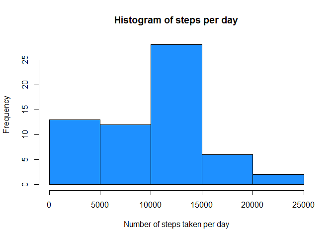

# Reproducible Research: Peer Assessment 1

    
####**Introduction**

*This report was written in fullfillment of the first assignment of week 2 of the 'Reproducible Research' course within the Coursera specialization track 'Data Science'*

*The questions adressed here relate to a dataset containing data from a personal activity monitoring device. This device collects data at 5 minute intervals through out the day. The data consists of two months of data from an anonymous individual collected during the months of October and November, 2012 and include the number of steps taken in 5 minute intervals each day.*
  

## Loading and preprocessing the data

To access the data, the dataset heas to be downloaded from the course website


```r
# First, make sure a folder named 'data' exists
if(!file.exists("data")) {
        dir.create("data")
}
setwd("./data")

# Downloading file...
temp <- tempfile()
fileURL <- "https://d396qusza40orc.cloudfront.net/repdata%2Fdata%2Factivity.zip"
download.file(fileURL,temp, mode="wb")
unzip(temp)

# Reading data
data <- read.csv("activity.csv")
```

  

## What is mean total number of steps taken per day?

The following are a basic set of computations on the average amount of steps taken. In this analysis it was
explicitely allowed to include any missing values.

-  First, we want to calculate the total number of steps taken each day.


```r
steps_day <- tapply(data$steps, data$date, sum, na.rm=TRUE)
```

- Next, we want to make a histogram of the total number of steps per day


```r
hist(steps_day, main = ("Histogram of steps per day"), xlab = "Number of steps taken per day", col = "dodgerblue")
```

<!-- -->

- Finally, we want to calculate some summary statistics on the total number of steps per day. Is appears that the mean total number of steps per day is 9,354. Given that an average step (or pace) is about 0.75 meters (source: https://en.wikipedia.org/wiki/Pace_(unit)), the mean distance travelled per day would be about 7 kms.


```r
summary(steps_day)
```

```
##    Min. 1st Qu.  Median    Mean 3rd Qu.    Max. 
##       0    6778   10400    9354   12810   21190
```


## What is the average daily activity pattern?

Now that we understand how many steps in total are taken, we want to zoom in on the daily pattern. To do this, we will be calculating and plotting the the average number of steps taken (averaged across all days) per time interval


```r
avg_day <- tapply(data$steps, data$interval, mean, na.rm=TRUE)
plot(avg_day, type="l", xaxt = "n", xlab="Time interval", ylab="Average number of steps taken")
axis(1, at=1:288, labels=unlist(dimnames(avg_day)))
```

<!-- -->

It seems that on average in the early morning the highest average number of steps are being taken
The most 'active' time interval is "835" which means that on average the most steps (206) are taken between 08:30 and 08:35 AM


```r
avg_day[avg_day==max(avg_day)]
```

```
##      835 
## 206.1698
```


## Imputing missing values

Note that in the data there are a number of days/intervals where there are missing values (coded as NA). 
The presence of missing days may introduce bias into some calculations or summaries of the data.
Before, they were ignored, but now we want to look for a way to fill up these NA's

- First we want to get a feeling for how big the issue with the NA's really is. Therefore we want to report the total number of NA's in the dataset. Counting the NA's by day gives more insight.


```r
count_na<-tapply(is.na(data$steps), data$date, sum)
count_na[count_na>0]
```

```
## 2012-10-01 2012-10-08 2012-11-01 2012-11-04 2012-11-09 2012-11-10 
##        288        288        288        288        288        288 
## 2012-11-14 2012-11-30 
##        288        288
```

```r
sum(count_na)
```

```
## [1] 2304
```

As we can see, the total number of NA's is 2304, equally devided over 8 separate days with 288 missing values. Since the time interval in the dataset is 5 minutes, there are 288 possible datapoints for each day (=60/5*24). This means that the NA's are explained as exactly 8 completely missing days 

- Now we have to come up with a strategy for filing in the missing values. As we concluded, the missing values are making up completely missing days in the dataset. It therefore seems logically to replace the NA's on a missing day with the total average values per interval (over all of the measured days)

- Now that we have devised a strategy, we can go to work. Fortunately, we already created a variable called 'avg_day' that shows the average numer of steps per time interval. We wil be using this variable to fill in the blanks.


```r
# First, a copy of the original data is being made
data2 <- data

# Create a column with the stand-in data
data2$replacement <- avg_day

# When steps is na, replace with stand-in

# Please note that you will get a warning message here, but NA's will be replaced

# Warning message:
#       In data2$steps[is.na(data2$steps)] <- data2$replacement :
#       number of items to replace is not a multiple of replacement length

data2$steps[is.na(data2$steps)] <- data2$replacement
```

```
## Warning in data2$steps[is.na(data2$steps)] <- data2$replacement: number of
## items to replace is not a multiple of replacement length
```

```r
# Check that there are no more NA's: 
sum(tapply(is.na(data2$steps), data2$date, sum))
```

```
## [1] 0
```

- To show the impact of the changes, let's make histograms of the average number of steps taken per day before and after the imputation.  


```r
steps_day2 <- tapply(data2$steps, data2$date, sum, na.rm=TRUE)

par(mfrow=c(1,2))

hist(steps_day, main = ("Histogram of steps per day\n(Original Data)"), ylim = c(0,40), xlab = "Number of steps per day", labels = TRUE, col = "dodgerblue") 
hist(steps_day2, main = ("Histogram of steps per day\n(Imputed Data)"), ylim = c(0,40), xlab = "Number of steps per day", ylab = NULL, labels = TRUE, col = "dodgerblue")
```

<!-- -->

So the low number of steps has decreased when replacing missing values in the dataset. The peak at the center of the histogram is amplified
Finally, when we look at some summarized statistics before and after, we see that after imputation, the median value had moved to the right (to 10,770 steps) and that the average number of steps has increased with 15% to also 10,770 steps.


```r
summaries <- rbind(summary(steps_day), summary(steps_day2))
row.names(summaries) <- c("Original data", "Imputed data")
print(summaries)
```

```
##               Min. 1st Qu. Median  Mean 3rd Qu.  Max.
## Original data    0    6778  10400  9354   12810 21190
## Imputed data    41    9819  10770 10770   12810 21190
```

## Are there differences in activity patterns between weekdays and weekends?

To complete the exploration of the provided dataset, we will now be showing differences in activity patterns between weekdays and weekends (using the dataset with the filled-in missing values)

- First we start off by specifying whether a given day is a weekday (mon-fri) or part of the weekend (sat, sun)


```r
# We start by retreiving the name of the date
data2$date <- as.Date(as.character(data2$date), format = "%Y-%m-%d")
data2$weekday <- weekdays(data2$date)
```

```r
# Please note that the weekdays are stated in the Dutch language, which is my native language
unique(data2$weekday)
```

```
## [1] "maandag"   "dinsdag"   "woensdag"  "donderdag" "vrijdag"   "zaterdag" 
## [7] "zondag"
```

```r
# Recoding datenames
data2$part_of_week <- ifelse(data2$weekday %in% c("zaterdag", "zondag"), 
                        c("Weekend"), c("Weekday")) 

# And here a table to help understanding Dutch names for weekdays :)
table(data2$weekday, data2$part_of_week)
```

```
##            
##             Weekday Weekend
##   dinsdag      2592       0
##   donderdag    2592       0
##   maandag      2592       0
##   vrijdag      2592       0
##   woensdag     2592       0
##   zaterdag        0    2304
##   zondag          0    2304
```

```r
# Specify as factor
data2$part_of_week <- as.factor(data2$part_of_week)
```
 - Now that the 2 parts of the week are calculated, we can now plot the difference between them. Here, we will be making a panel plot containing a time series plot (i.e. type = "l") of the 5-minute interval (x-axis) 
and the average number of steps taken, averaged across all weekday days or weekend days (y-axis). 


```r
library(ggplot2)
```

```
## Warning: package 'ggplot2' was built under R version 3.2.5
```

```r
ggdata <- aggregate(steps ~ part_of_week+interval, data2, mean)
ggplot(data=ggdata, aes(x=interval, y=steps)) + 
        geom_line() + 
        facet_wrap(~part_of_week, ncol=1) + 
        labs (x="Interval", y="Number of steps")+
        theme(strip.background = element_rect(fill="pink"), panel.background = element_rect(fill = "white"))
```

<!-- -->

Looking at the plot one can conclude that peak activity in the weekend is lower. Activity also seems to start later, probably due to the fact that the subjects were sleeping in (or at least weren't going to work or doing any other major activities). Also, there seems to be more activity after 20:00h.
